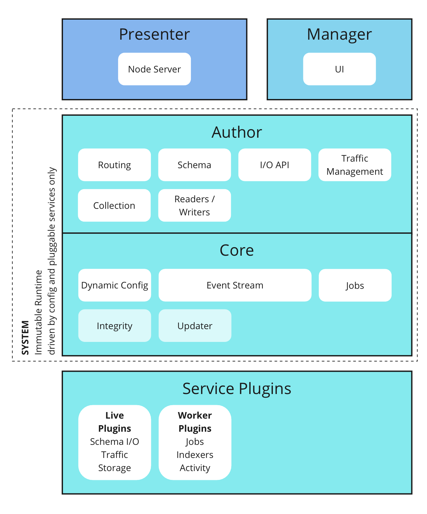

# Parrot Architecture

Parrot is a CMS built around these core ideas:
- It is a CMS built for a future web where there can be many interfaces into content: websites, chat interfaces, APIs and more.
- It is built with diverse hosting environments in mind. It can be run simply on a file system or on cloud infrastructure, distributed and scaled.
- It can be extended to alter core functionality, making it extremely versatile.
- It is fault tolerant, secure and performant.

## Introduction

Parrot runtime is broken into a core system and parts that can be substituted easily. 

`system` is the immutable core of Parrot. It has two main parts:
- `core` implements the core systems required for Parrot to function. This includes the config loader, event stream and the `main()` and `runJobs()` functions.
- `author` is the content system that is responsible for maintaining CMS functions like content schema, routing, authentication and the core API to interface with the system.

Pluggable pieces of Parrot are as follows:
- `presenter` module is the server runtime that serves requests. This can be substituted by a custom frontend application if required.
- `manager` is the management UI to edit content and configure Parrot. If you are building a social networking app or an experience where content is generated using a presenter app, this can happen seamlessly through `author` APIs.
- `services` are plugins that can be configured to run in various points of the execution cycle to extend the functionality of Parrot. Some service plugins will run in the background, invoked by events in the event stream. Others are live plugins that will be invoked to aid runtime functionality.

## Notes

### Hosting friendly
Intention of Parrot is to run one or multiple instances with minimal resources. There is no need to maintain multiple docker instances for each hosting setup. Parrot can be configured to load configuration for each request, allowing the execution cycle to run agnostic of the hosting instance.

